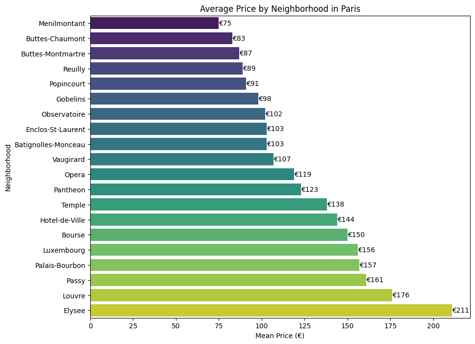
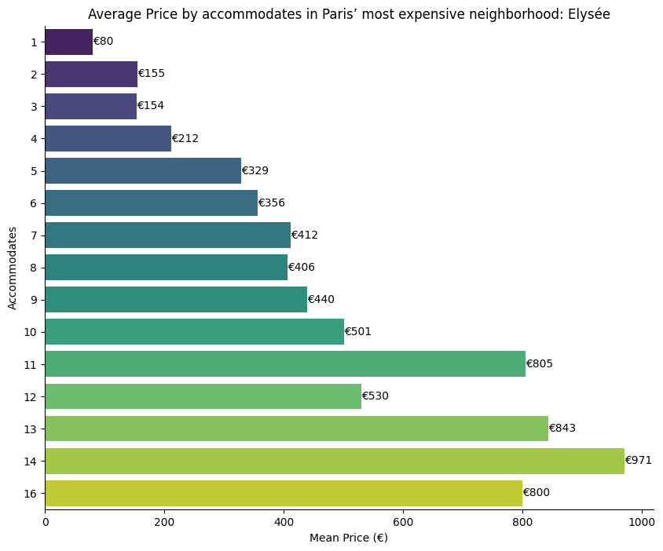
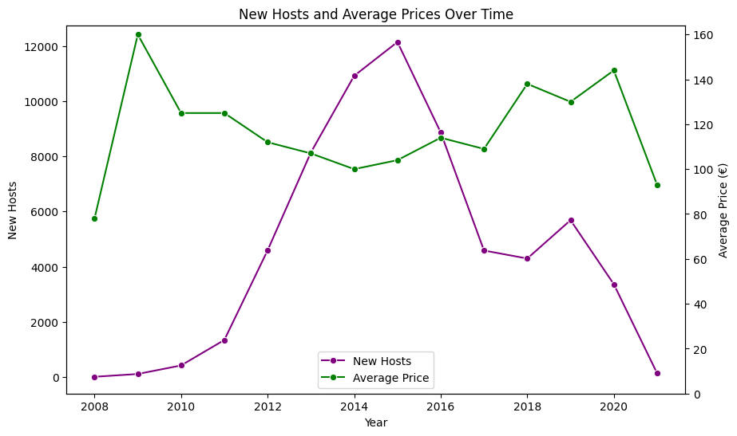

# AirBnB Listing Analysis using SQL and BigQuery

## Analyzing AirBnB listings in Paris to determine the impact of recent regulations

The dataset made available by [Maven Analytics](https://app.mavenanalytics.io/)

You can find the csv file here on [Kaggle](https://www.kaggle.com/datasets/toufikbhm/airbnb-listings-and-reviews)

I uploaded the dataset to BigQuery for the purpose of this project.

# The average price by neighborhood in Paris

> The Elysée emerges as Paris’ most expensive neighborhood with €211 in average, highlighting its prestige and likely luxury offerings.

# The average price by accommodates in Paris’ most expensive neighborhood

> Generally, as the number of accommodates increases, the mean price tends to increase as well, which is expected.
> While there is a general increasing trend, there are fluctuations in mean prices across different accommodation capacities. These fluctuations could be influenced by various factors such as seasonal demand, location, amenities provided, etc.
> There are a couple of instances where the mean price seems unusually high compared to the trend.These outliers might be due to special features or unique characteristics of properties that can accommodate such large groups.

# New hosts and average price over time comparaison

> We can observe a decline in the number of new hosts after the implementation of new regulations in France in 2015. Additionally, the average price increased as a consequence of these regulations until the onset of the 2020 pandemic.